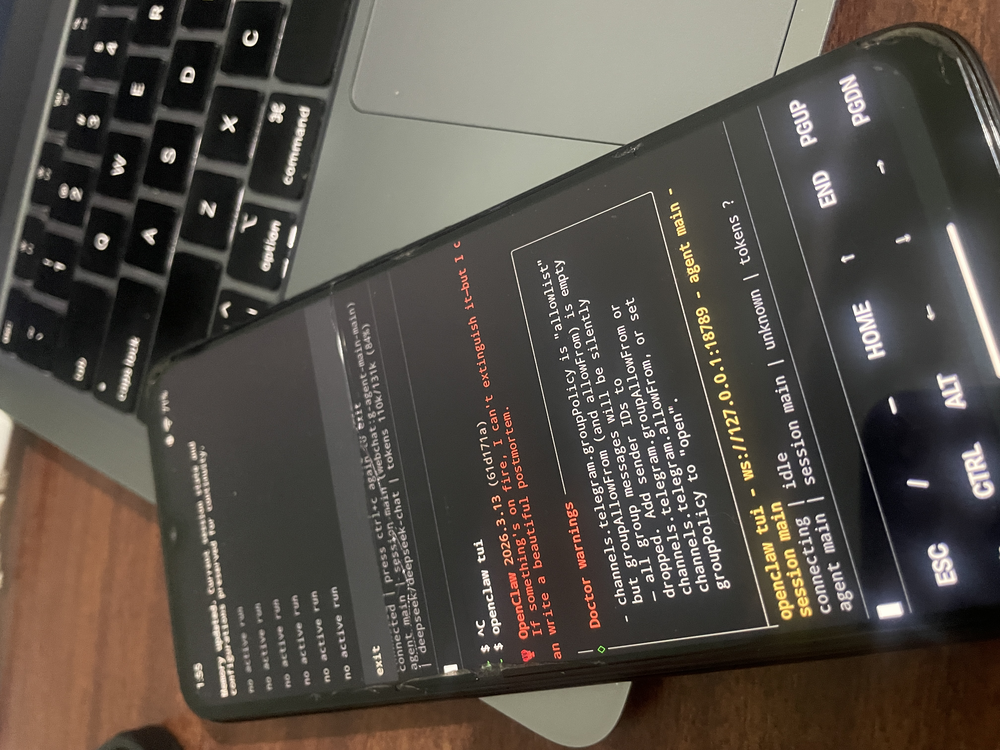

# Run OpenClaw Natively on Android via Termux — No Root, No Ubuntu, No proot

> **The fastest way to run an AI agent gateway on any Android phone.**

  

Most guides tell you to install Ubuntu inside Termux using proot-distro before running OpenClaw.  
It works — but it's **slow, bloated, and laggy**.

This repo documents a different approach: **OpenClaw running directly on Termux's native environment.**  
No proot. No Ubuntu container. No extra 300MB overhead. Just Termux + a tiny Node.js patch to fix Android's Bionic libc incompatibilities.

> Discovered, tested, and documented by [@Mohd-Mursaleen](https://github.com/Mohd-Mursaleen). No official docs cover this method.

---

## Why This Matters

|                         | proot + Ubuntu (common method) | Native Termux (this guide) |
| ----------------------- | ------------------------------ | -------------------------- |
| Boot time               | 10–30 seconds                  | ~2 seconds                 |
| Extra RAM usage         | ~300MB+ for Ubuntu layer       | Minimal                    |
| OpenClaw responsiveness | Slow, laggy                    | Fast, snappy               |
| Setup complexity        | High                           | Low                        |
| Root required           | No                             | No                         |

---

## Full Setup Guide

👉 **[docs/SETUP.md](./docs/SETUP.md)** — Complete step-by-step installation

---

## What You Can Build With This

Once OpenClaw is running natively on your Android device, you can build:

- 📱 **Android Automation Agents** — control any app via ADB + AI ([see repo](https://github.com/Mohd-Mursaleen/android-automation-agent))
- 📷 **Kitchen Surveillance** — AI agent monitors your kitchen camera feed 24/7
- 🎟️ **Movie Ticket Booking Bot** — agent navigates BookMyShow and books tickets autonomously
- 🔄 **Always-on AI Gateway** — turn an old Android phone into a 24/7 agent server

---

## Android Automation via ADB

Want your OpenClaw agent to control other apps on the phone?  
You need to bridge Termux to the Android OS via ADB.

👉 **[docs/ADB-BRIDGE.md](./docs/ADB-BRIDGE.md)** — ADB setup guide

---

## Use Cases

Real things built with this setup:

👉 **[docs/USE-CASES.md](./docs/USE-CASES.md)** — Android automation, kitchen surveillance, ticket booking

---

## Related

- [android-automation-agent](https://github.com/Mohd-Mursaleen/android-automation-agent) — ADB-powered Android automation skill for OpenClaw
- [OpenClaw](https://openclaw.ai) — The AI agent gateway this setup runs

---

## Keywords

`openclaw` `android` `termux` `ai-agent` `no-root` `no-proot` `llm` `agent-gateway` `android-automation` `adb` `nodejs-android` `termux-setup` `self-hosted-ai` `mobile-ai`

---

If this helped you, drop a ⭐ — it helps others find this.

