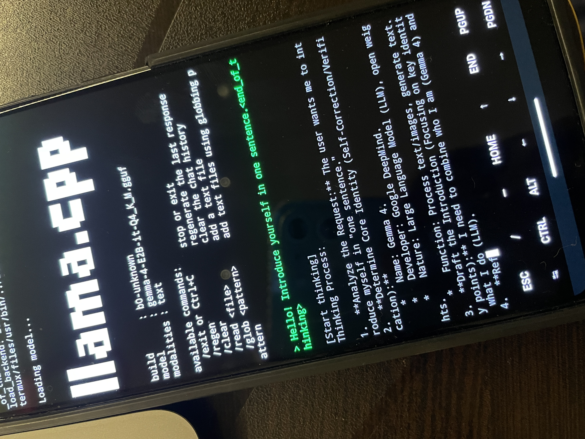

# Local LLM on Android — Gemma 4 via LiteRT-LM (Not llama.cpp)

<p align="center">
  
</p>

Running a local LLM on Android sounds simple. It isn't. Here's what actually works — and why the common approach fails.

---

## The Common Approach: llama.cpp

Most guides (including the popular ones with GitHub stars) tell you to run `llama.cpp` in Termux.

It works. But it's **CPU-only**. On a phone, that means:
- Gemma 4 runs at ~2–3 tokens/second
- The phone heats up immediately
- Unusable for any real agent workflow

This is the approach used by most "OpenClaw on Android" repos floating around. It's technically correct but practically obsolete.

---

## What Actually Works: Google LiteRT-LM

Google ships an app called **AI Edge Gallery** that runs the same Gemma 4 model — on the same phone — **fast**.

The difference: it uses **LiteRT-LM** (formerly TensorFlow Lite), which uses **GPU + CPU together** via Android's NNAPI and GPU delegate. llama.cpp was CPU only.

Same phone. Same model. Completely different experience.

---

## The Approach: Expose LiteRT-LM as a Local API

The idea: build a small Android app that:
1. Runs Gemma 4 via LiteRT-LM (GPU-accelerated)
2. Exposes it on a local port (e.g. `localhost:8080`)
3. Termux makes API calls to it
4. OpenClaw uses it as its LLM backend — fully offline

```
OpenClaw (Termux)
      ↓  HTTP API call
LiteRT-LM App (localhost:8080)
      ↓
  Gemma 4 (GPU-accelerated)
      ↓
  Android GPU/NPU
```

One phone. One brain. Zero cloud.

---

## Why This Matters for OpenClaw

With a local LLM serving via API on the same device:
- OpenClaw can run **fully offline** — no API keys, no internet
- Image processing becomes possible — pass screenshots from ADB directly to the local model
- Latency is local network latency, not internet round-trip
- Private by default — nothing leaves the device

This unlocks use cases like:
- Offline Android automation agent
- Local image analysis (kitchen camera, screen reader)
- Air-gapped agent deployments

---

## Hardware Reality Check

This only works well on phones with a **dedicated NPU or strong GPU**.

| Device tier | LiteRT-LM experience |
|---|---|
| Flagship (Snapdragon 8 Gen 2+, Dimensity 9200+) | Fast, usable, smooth |
| Mid-range (Snapdragon 7s, Dimensity 7000) | Slow but functional |
| Budget / old phones | Too slow, high heat |

llama.cpp on any of the above = slow regardless of chip, because it doesn't use the GPU.

---

## Status

This is an ongoing experiment. The LiteRT-LM app that exposes Gemma 4 as a local API is being built.

Full technical write-up with architecture details, benchmark numbers, and build instructions:  
🔗 [geekymd.me/blog/running-local-llm-on-android](https://geekymd.me/blog/running-local-llm-on-android)

---

## vs. The llama.cpp Approach

| | llama.cpp in Termux | LiteRT-LM App (this approach) |
|---|---|---|
| GPU acceleration | ❌ CPU only | ✅ GPU + CPU via NNAPI |
| Speed on Gemma 4 | ~2–3 tok/s | Usable |
| Setup complexity | Simple | Higher (needs Android app) |
| Works offline | ✅ | ✅ |
| Usable with OpenClaw | ❌ Too slow | ✅ |
| Status | Obsolete for agent use | Active experiment |

---

> Built and written by [@Mohd-Mursaleen](https://github.com/Mohd-Mursaleen).  
> This is original research — no one else has documented this approach for OpenClaw.
